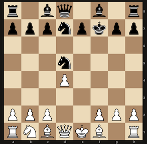

# ChessAnalysisServer
A quick project to have a web server that calls out to a chess engine to analyze a position and returns the response in JSON.
Results are cached into a persistent sqlitedict file.

Sample request:
`http://127.0.0.1:5000/analyze?depth=20&fen=r1bq1b1r/pppnpkpp/8/3n4/3P4/8/PPP2PPP/RNBQKB1R%20w%20KQ%20-%200%201`

For this position:



Response:
```
{
    "cached":    false,
    "depth":     20,
    "elapsed":   7.275815963745117,
    "ev":        132,
    "fen":       "r1bq1b1r/pppnpkpp/8/3n4/3P4/8/PPP2PPP/RNBQKB1R w KQ - 0 1",
    "move_san":  "Qh5+",
    "move_uci":  "d1h5",
    "nodes":     933033,
    "pv_san":    "Qh5+ Ke6 c4 Nb4 a3 Nc2+ Kd1 Nf6 Qe5+ Kf7 Kxc2 g6 Bd3 Bg7 Nc3 Nh5 Qe2 Qxd4 Be3 Qf6 Rhe1 Rf8 g3 Kg8 Bc5 Bf5 Rad1",
    "pv_uci":    "d1h5 f7e6 c2c4 d5b4 a2a3 b4c2 e1d1 d7f6 h5e5 e6f7 d1c2 g7g6 f1d3 f8g7 b1c3 f6h5 e5e2 d8d4 c1e3 d4f6 h1e1 h8f8 g2g3 f7g8 e3c5 c8f5 a1d1",
    "white_wdl": 0.942
}
```
